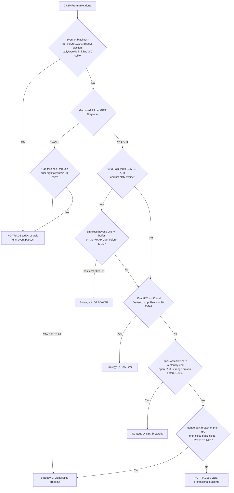

# Five Documented Day Traders → An Indian Intraday Playbook

*Research date: 3 October 2026. Written from a risk-first point of view. Nothing here is investment advice, and no strategy in it is claimed to make money. Every number marked "hypothetical" is an illustration, not a forecast.*

**Evidence labels used throughout**

| Tag | Meaning |
|---|---|
| **[S]** | The trader stated it themselves (book, interview, own website). Paraphrased unless in quotes. |
| **[D]** | Documented by a credible third party (regulator, exchange, peer-reviewed paper, established publisher, long-form interview write-up). |
| **[I]** | My own interpretation or inference. Treat it as a hypothesis. |
| **[BT]** | A parameter that must be backtested on Indian data before you use it. |

Companion code: [`tools/intraday_lab.py`](../tools/intraday_lab.py) (cost model, position sizing, loss-streak and drawdown maths, and a small 5-minute backtester). Every ₹ figure for costs and losing streaks in this document came from that script.

---

## 0. Read this first: the base rate

Before looking at the winners, look at the population:

* **India, F&O:** SEBI's July 2025 study found that **91% of individual equity-derivative traders lost money in FY25**. Their aggregate net loss was about **₹1.06 lakh crore**, roughly ₹1.1 lakh per person. In every year from FY22 to FY25 the share of loss-makers was 89–93% **[D]** ([Business Standard](https://www.business-standard.com/markets/news/net-losses-of-traders-in-fo-widens-in-fy25-sebi-study-125070701221_1.html), [Moneylife](https://www.moneylife.in/article/106-lakh-crore-lost-by-individual-traders-in-fo-in-fy2425-govt-confirms-sebi-action-on-4-entities-for-market-abuse/79124.html)).
* **India, cash intraday:** **over 70%** of individual intraday traders lost money in FY23. Among those making more than 500 trades a year, the figure was **80%**. Loss-makers paid trading costs equal to a further 57% of their losses **[D]** ([Business Standard](https://www.business-standard.com/markets/news/over-70-intra-day-traders-incur-losses-during-fy23-reveals-sebi-study-124072401110_1.html), [TaxGuru summary](https://taxguru.in/sebi/sebi-study-finds-7-10-individual-intraday-traders-equity-cash-segment-losses.html)).
* **Taiwan, 1992–2006:** fewer than **1%** of day traders were *predictably* profitable net of fees **[D]** (Barber, Lee, Liu & Odean, [paper](https://faculty.haas.berkeley.edu/odean/papers/Day%20Traders/Day%20Trading%20and%20Learning%20110217.pdf)).
* **Brazil:** **97%** of individuals who day-traded mini-index futures for more than 300 days lost money. Only 1.1% earned more than the minimum wage **[D]** (Chague, De-Losso & Giovannetti, [SSRN](https://papers.ssrn.com/sol3/papers.cfm?abstract_id=3423101)).

**[I] What this means for you.** The question is not "which strategy wins". It is "how do I avoid the behaviour of the 90%?" The data points to three answers: trade fewer times, keep costs small relative to risk, and size so that a losing streak cannot end your trading. That is why risk management (Section 7) is the foundation of this playbook.

---

## 1. The five traders

### How they were selected (and who was excluded)

Selection criteria: (a) a long career; (b) a methodology published in their own words; (c) some *external* evidence of results, such as regulatory registration, an audited real-money competition, an institutional firm, or exchange-level business success; (d) intraday or very short-term rules that can be written as an algorithm.

| Selected | Why |
|---|---|
| **Linda Bradford Raschke** | 44+ years trading; registered CTA from 1992 and CPO from 2002 (retired 2015); featured in *The New Market Wizards*; co-author of *Street Smarts* (1995) with fully specified setups. |
| **Toby Crabel** | Wrote the original quantitative opening-range-breakout (ORB) research (1990); founded Crabel Capital Management, an institutional systematic firm reported at about $5B AUM. |
| **Mark B. Fisher** | NYMEX floor trader; founder of MBF Clearing; *The Logical Trader* (Wiley, 2002) gives the ACD opening-range method in full. |
| **Larry Williams** | Won the 1987 Robbins World Cup (real money, +11,376%); has published short-term rules for decades (*Long-Term Secrets to Short-Term Trading*, 1999). |
| **Andrea Unger** | Only four-time winner of the World Cup Trading Championship, futures division (2008, 2009, 2010, 2012; real-money accounts); fully systematic; documented intraday session-breakout systems. |

**Excluded, and why [I]:**
* **Ross Cameron / Warrior Trading:** the FTC settled with Warrior Trading in 2022 over deceptive earnings claims in its marketing. That makes the educational claims unreliable as evidence.
* **Tom Hougaard:** trades openly, but has no audited multi-year record.
* **Paul Rotter:** has a reputation but no published method.
* **Mark Minervini, Peter Brandt, Jesse Livermore:** swing or position traders, not day traders.
* **Andrew Aziz:** used below as a co-author of *academic* ORB/VWAP studies, not as a "trader with a track record".

**A caveat on every name [I].** None of these five has published a full, audited, multi-decade personal P&L. The evidence is circumstantial: regulatory registrations, contest results, institutional AUM, peer recognition. Contest returns (Williams, Unger) were earned with leverage chosen *to win a contest*, and both have said so in effect **[D]** ([AlgoAdvantage on Unger](https://algoadvantage.substack.com/p/038-andrea-unger-672-returns-sure)). Do not treat contest percentages as achievable returns.

---

### 1.1 Linda Bradford Raschke

1. **Who.** A professional trader since 1981. She started on the options floors of the Pacific Coast and Philadelphia exchanges. She was a registered CTA from 1992 and a CPO for her own fund from 2002, retiring both registrations in 2015. Her bio states her fund ranked 17th of 4,500 for 5-year performance by BarclayHedge (this is self-reported on her site). She received the IFTA Lifetime Achievement Award in 2024 **[S]** ([bio](https://lindaraschke.net/bio-linda/)).
2. **Markets.** Futures (index, bonds, commodities), equities and options **[S]**.
3. **Style and horizon.** Short-term swing trading plus intraday trading. Most *Street Smarts* setups last 1–5 days, and she also day-trades with the same patterns on intraday charts **[D]**.
4. **Core strategy.** Pattern-based trading of (a) **pullbacks within strong trends** and (b) **failed breakouts / reversals**, plus volatility-contraction setups **[D]** (*Street Smarts*, 1995).
5. **Setup identification.**
   * **Holy Grail:** 14-period ADX above 30 and rising, meaning a strong trend. Price then pulls back to the 20-period EMA **[D]**.
   * **Turtle Soup:** the market makes a new 20-period low, but the *previous* 20-period low was at least 4 bars earlier. You trade the failure of that breakout **[D]**.
   * **80-20:** the prior bar opened in its bottom 20% and closed in its top 20% (or the reverse). Look for a reversal the next morning **[D]** ([summary](https://www.scribd.com/document/194332066/80-20-S-from-Street-Smarts-High-Probability-Short-Term-Trading-Strategies-Raschke)).
6. **Entry.**
   * Holy Grail: buy stop above the high of the bar that touched the 20 EMA.
   * Turtle Soup: buy stop at the earlier 20-period low once price trades back up through it.
   * All entries are **stop orders**, so price must move in your favour to fill you **[D]**.
7. **Exit.** Holy Grail: target a retest of the recent swing extreme, then trail. Reversal setups: take quick partial profits **[D]**.
8. **Stop-loss.** Just beyond the extreme of the pattern, such as the low of the pullback or the new low that failed **[D]**.
9. **Position sizing.** No single formula is published in *Street Smarts* **[I]**. She speaks of trading small and of consistency over home runs **[S, paraphrased]**.
10. **Risk management.** Predefined stops; quick exits when a pattern does not behave as expected; taking partial profits **[D]**.
11. **Losing streaks.** She describes a "trade-small, rebuild-rhythm" approach after poor periods **[S, paraphrased; secondary sources]**. No published numeric rule exists **[I]**.
12. **Market-condition filter.** ADX separates trending from non-trending conditions. Trend-pullback setups need ADX above 30. Reversal setups (Turtle Soup, 80-20) are for failed moves and ranges **[D]**.
13. **Timeframes.** Daily bars for most published setups. Intraday traders apply them on 5-, 15- and 60-minute charts **[D/I]**.
14. **Indicators.** ADX(14), 20 EMA, 20-bar highs and lows. She has also discussed a 3/10 oscillator and Keltner channels **[D]**. **Central or decorative?** ADX and the 20 EMA are *central* to the Holy Grail, because they define the setup. For the reversal setups, price structure (prior highs and lows) is what matters, and the indicators are secondary **[I]**.
15. **What not to do.** Do not buy the *first* breakout in a mature range, because that is exactly what Turtle Soup fades. Do not hold reversal trades hoping they turn into trends **[D/I]**.
16. **Evidence.** Regulatory registrations (verifiable at NFA BASIC), Market Wizards profile, decades of continuous practice, IFTA award **[D]**. There is no published independent audit of the *Street Smarts* setups' live results **[I]**.
17. **Limitations.**
    * The setups were published in 1995 on 1990s futures markets, and widely known patterns may decay.
    * The Holy Grail's 30 ADX threshold was chosen for daily bars. On 5-minute Nifty bars it needs fresh calibration **[BT]**.
    * Reversal setups have no natural stop distance in fast markets and suffer badly from gaps **[I]**.

### 1.2 Toby Crabel

1. **Who.** Founder of Crabel Capital Management, an institutional systematic multi-strategy manager reported at about $5B AUM. He wrote *Day Trading with Short Term Price Patterns and Opening Range Breakout* (Traders Press, 1990), now out of print **[D]** ([AlgoAdvantage interview write-up](https://algoadvantage.substack.com/p/055-toby-crabel-short-term-futures), [Google Books](https://books.google.com/books/about/Day_Trading_with_Short_Term_Price_Patter.html?id=xpgbAAAACAAJ)).
2. **Markets.** Originally US futures (S&P, bonds, commodities). In recent interviews he discusses Asian sessions, such as the Hang Seng pre-open **[D]**.
3. **Style and horizon.** Intraday to a few days **[D]**.
4. **Core strategy.** The **opening range breakout**, conditioned on **volatility contraction**. "Contraction precedes expansion": after narrow-range days (NR4, NR7, inside days), the next day's breakout from the open is more likely to run **[D]**.
5. **Setup identification.**
   * **NR7:** today's range is the narrowest of the last 7 days. **NR4** uses 4 days. **ID/NR4** is an inside day that is also NR4.
   * The **"stretch"**, a breakout distance from the open, is commonly described as the 10-day average of the smaller of (high − open) and (open − low) **[D, widely reported book summaries]** ([StockCharts NR7](https://chartschool.stockcharts.com/table-of-contents/trading-strategies-and-models/trading-strategies/narrow-range-day-nr7)).
6. **Entry.** A buy stop at open + stretch, or a sell stop at open − stretch, usually early in the session. The book also discusses "early entry" in the first minutes **[D]**.
7. **Exit.** Many of the book's statistics measure holding to the session close or a few days **[D]**. In his interview he says he sets exit criteria in advance **[S, via interview]**.
8. **Stop-loss.** The opposite side of the opening range or a fixed fraction of it **[D/I]**.
9. **Position sizing.** Not published for individuals. As an institution, the firm sizes by volatility **[I]**.
10. **Risk management.** Systematised thresholds so that emotion cannot override them; testing through crashes such as 1987 and 2020 **[S, via interview]**.
11. **Losing streaks.** He acknowledges that **ORB has had "its worst years in the last three to five years"** and that he now watches 15–20 reference levels per market instead of the original two **[S, via interview]**. That is a rare and valuable admission that edges decay.
12. **Market-condition filter.** Prior-day contraction (NR4, NR7, inside day) is the filter **[D]**.
13. **Timeframes.** Daily bars for the filter; intraday for the trigger **[D]**.
14. **Indicators.** None in the usual sense. Only price ranges relative to recent ranges **[D]**. *Central:* range contraction and the opening print.
15. **What not to do.** Do not trade every breakout. Breakouts after *wide*-range days have worse follow-through **[D/I]**.
16. **Evidence.** An institutional firm built on his research **[D]**. Academic ORB studies give partial support: Holmberg, Lönnbark & Lundström (2013, *Finance Research Letters*) on crude-oil futures; Zarattini & Aziz (2023, [SSRN 4416622](https://papers.ssrn.com/sol3/papers.cfm?abstract_id=4416622)) on US stocks and QQQ **[D]**.
17. **Limitations.**
    * There is widely documented decay in plain ORB (his own words).
    * An independent replication of the Zarattini 5-minute QQQ ORB found it **broke even at about 2.2¢/share of slippage**, so the edge is fragile to costs ([replication repo](https://github.com/giovannibrusco/zarattini-2023-orb-qqq), not peer-reviewed) **[D]**.
    * This matters a great deal for India, where costs per round trip are now high (Section 3) **[I]**.

### 1.3 Mark B. Fisher

1. **Who.** Former NYMEX floor trader and founder of MBF Clearing Corp, described as the largest clearing firm on NYMEX. Author of *The Logical Trader: Applying a Method to the Madness* (Wiley, 2002) **[D]** ([Wiley](https://www.wiley-vch.de/en/areas-interest/finance-economics-law/finance-investments-13fi/trading-13fi4/the-logical-trader-978-0-471-21551-6)).
2. **Markets.** Energy futures (crude oil, natural gas), later stocks and other futures **[D]**.
3. **Style and horizon.** Intraday, extending to multi-day ("macro ACD") **[D]**.
4. **Core strategy.** The **ACD method**: trade breakouts from the **opening range (OR)**, but only after price has moved a defined distance beyond it (the "A" level) *and stayed there for a defined time*. A **failed A** that reverses through the other side becomes a "C" trade in the opposite direction **[D]**.
5. **Setup identification.**
   * OR length is chosen per market. Excerpts cite 5–10 minutes for intraday stock trading and longer for crude oil.
   * A and C values are often **20–25% of a 5- or 10-day ATR**.
   * The **pivot range** comes from the prior day: pivot = (H+L+C)/3, and the range is pivot ± |pivot − (H+L)/2|.
   * **Narrow pivot ranges** (for example the narrowest in about 9 days, or 3 successively smaller) are flagged as precursors to volatile sessions **[D, via book excerpts]** ([Elite Trader excerpts](https://www.elitetrader.com/et/threads/excerpts-from-the-1400-page-acd-method-thread-mark-fisher.377419/)).
6. **Entry.** Price trades through A up (OR high + A value) and holds there for a time requirement **[D]**. The exact time rule should be read in the book; secondary summaries vary **[I]**.
7. **Exit.** Use the pivot range and prior levels as targets. Daily scoring (the "number line") tracks a trend over about 30 days and influences whether to hold **[D/I]**.
8. **Stop-loss.** Fisher's key idea: **"minimize your risk by time, not by price."** If a breakout does not follow through within the expected time, exit **[S, quoted in excerpts]**. Price stops sit on the other side of the OR / B level **[D]**.
9. **Position sizing.** Not formally specified in the material reviewed **[I]**.
10. **Risk management.** "ACD is about RISK management… knowing where to get out more than where to get in" **[S, quoted in excerpts]**.
11. **Losing streaks.** No published numeric rule was found **[I]**.
12. **Market-condition filter.** Narrow pivot ranges are favourable. **Avoid trading ACD the day after a wide-range or strong trend day**, because the next day is less likely to trend **[D, via excerpts]**.
13. **Timeframes.** Intraday OR; daily pivots; a 30-day number line **[D]**.
14. **Indicators.** None beyond OR, ATR-derived offsets and pivot ranges. *Central:* the OR plus the time confirmation.
15. **What not to do.** Do not trade it purely mechanically. One practitioner thread notes pure-mechanical ACD lost money **[D, practitioner claim; weak evidence]**. Be cautious in crowded markets where stops cluster **[D]**.
16. **Evidence.** The business success of MBF Clearing and an established Wiley publication **[D]**. There is no public personal P&L **[I]**.
17. **Limitations.** Discretion matters, and the exact time rules are hard to reconstruct from secondary sources. Nifty is a crowded instrument, which is the kind of market he cautioned about **[I]**.

### 1.4 Larry Williams

1. **Who.** A trader since the 1960s. He won the 1987 Robbins World Cup Championship with a reported +11,376% in 12 months on real money. His daughter Michelle Williams won the same contest in 1997. Author of *Long-Term Secrets to Short-Term Trading* (1999) and the creator of Williams %R and the Ultimate Oscillator **[D]** ([Trading Greats profile](https://www.tradinggreats.com/traders/larry-williams), [QuantifiedStrategies review](https://www.quantifiedstrategies.com/review-of-larry-williamss-long-term-secrets-to-short-term-trading/)).
2. **Markets.** US futures: S&P, bonds, commodities **[D]**.
3. **Style and horizon.** Short-term: entries on the day, holding from intraday to a few days **[D]**.
4. **Core strategy.**
   * **Volatility breakout:** buy when price exceeds the open by a percentage of the prior day's (or recent days') range. A large move away from the open signals that the day's direction is set.
   * **"Oops":** a gap open beyond the prior day's extreme that reverses back through it **[D]**.
5. **Setup identification.** Range expansion relative to the prior range. Filters include day-of-week / trading-day-of-month, prior-day patterns ("smash days") and broader trend **[D]**.
6. **Entry.**
   * Volatility breakout: a stop order at open ± (X% × prior range).
   * Oops: a buy stop at the prior day's low after a gap down below it (mirror image for shorts) **[D]**.
7. **Exit.** His **"bail-out"** exit: get out at the first profitable opening. Otherwise use a time exit or a money stop **[D]**.
8. **Stop-loss.** A fixed money-management stop (a dollar amount) or a range-based stop **[D]**.
9. **Position sizing.** He popularised **contracts = (account equity × risk %) ÷ largest historical loss per contract** **[D]**. In 1987 he was trading contest-level leverage **[D/I]**.
10. **Risk management.** Fixed-fraction sizing based on the worst loss; always a money stop **[D]**.
11. **Losing streaks.** The contest record itself includes a very large drawdown from the peak, according to commonly repeated accounts **[D, secondary]**. This is the cautionary lesson: extreme leverage produces extreme swings **[I]**.
12. **Market-condition filter.** Calendar and pattern filters plus trend context **[D]**.
13. **Timeframes.** Daily bars for setups; intraday stop orders for execution **[D]**.
14. **Indicators.** %R and the Ultimate Oscillator are his inventions. However, the *volatility-breakout and Oops rules need no indicator*; they are pure price **[D/I]**.
15. **What not to do.** Do not size off your *average* loss; use the *largest* loss. Do not mistake contest returns for normal outcomes **[D/I]**.
16. **Evidence.** A real-money contest win and decades of published testing **[D]**. His published systems were often tested on US futures through the 1990s **[I]**.
17. **Limitations.** Contest returns are leverage-driven. Calendar filters are prone to data-mining. A 1990s S&P edge may not transfer to Nifty **[I/BT]**.

### 1.5 Andrea Unger

1. **Who.** An Italian former manager who became a full-time systematic trader. He is the **only four-time World Cup Trading Championship winner, futures division (2008, 2009, 2010, 2012)**, with 672% in 2008 on a real-money account **[D]** ([Unger Academy](https://ungeracademy.com/blog/the-unger-method-how-a-4-time-world-trading-champion-actually-trades), [MoneyShow profile](https://www.moneyshow.com/expert/4b59bbbbde6848cc95f06815f24557c2/andrea-unger/)).
2. **Markets.** A diversified futures portfolio: DAX, S&P, crude, metals, bonds, natural gas, copper, soybeans, Euro FX, GBP **[S]** ([Better System Trader](https://bettersystemtrader.com/016-andrea-unger/)).
3. **Style and horizon.** Fully automated, running intraday, daily and weekly systems **[S]**.
4. **Core strategy.** Simple entries (breakouts or reversals) filtered by **"patterns"**, which are daily-bar conditions such as performance after low-volatility days. These are used as setup filters, not as indicators **[S/D]**.
5. **Setup identification.** His early intraday systems on DAX and S&P took **the high and low of the first two to three hours as breakout levels**, then used **volatility patterns to filter out choppy days** **[S]**. The patterns look back 1–5 days **[S]**.
6. **Entry.** A stop order at the session high or low **[S]**. Example of a pattern-gated entry he has described: if yesterday's close was below the prior close, buy a breakout of yesterday's high **[S]**.
7. **Exit.** For the intraday session breakout: **no profit target, a stop-loss, and exit at the session end** **[S]**.
8. **Stop-loss.** A fixed stop per system, based on historical analysis **[S/D]**.
9. **Position sizing.** **Typically no more than about 1% of equity risked per trade, based on the worst historical loss.** Contracts are scaled by market volatility: one per system on DAX or crude, more on lower-volatility markets **[S/D]**.
10. **Risk management.** Diversify across uncorrelated systems and markets. Drawdown tolerance, not return, sets maximum leverage. He warns that risking beyond optimal f causes performance to "decrease very quickly" **[S]**.
11. **Losing streaks.** Separate a normal drawdown from edge decay. Do not change a system after every drawdown, but retire systems that have truly stopped working, with monthly review and rotation **[S/D]**.
12. **Market-condition filter.** Volatility and daily-bar patterns **[S]**. He matches style to market: trend-following on crude, mean reversion on the S&P **[D]**.
13. **Timeframes.** Intraday bars for execution; daily patterns for filters **[S]**.
14. **Indicators.** Minimal. The patterns and price levels are central **[S]**.
15. **What not to do.** Do not over-optimise. Do not cling to broken systems. Do not over-leverage **[S]**.
16. **Evidence.** Four real-money championship wins in five years, the strongest external evidence among the five **[D]**.
17. **Limitations.**
    * Contest years were traded at deliberately high risk **[D]**.
    * His edge comes partly from *portfolio diversification across 30–40 markets*, which an Nifty-only Indian trader cannot copy. India has few liquid, uncorrelated intraday instruments **[I]**.

---

## 2. Comparing the five approaches

| Trader | Strategy | Market condition | Entry | Exit | Stop loss | Position sizing | Holding time | Indicators | Main risk | Indian applicability [I] |
|---|---|---|---|---|---|---|---|---|---|---|
| Raschke | Trend-pullback (Holy Grail); failed-breakout reversal (Turtle Soup, 80-20) | Pullbacks: strong trend (ADX>30). Reversals: ranges / exhaustion | Stop order beyond the trigger bar | Swing retest, partials, trail | Beyond pattern extreme | Small, consistent (no published formula) | Intraday–5 days | ADX, 20 EMA, N-bar highs/lows | Whipsaw; gap through stop | **Good** on Nifty/Bank Nifty futures and liquid stocks; recalibrate ADX on intraday bars |
| Crabel | ORB + volatility contraction (NR4/NR7/ID) | After contraction days | Stop at open ± "stretch" | Session close or set rule | Opposite side of OR / fraction | Volatility-based (institutional) | Intraday–2 days | None (range statistics) | Edge decay; cost sensitivity | **Potentially suitable**; costs now hurt Nifty futures ORB (Section 3) |
| Fisher | ACD: OR + offset + time confirmation; failed-A reversal | Narrow pivot range; not after wide trend days | Through A level and holds for a time | Pivot/levels; number line | Time stop + opposite OR / B level | Not specified | Intraday–multi-day | OR, ATR offset, pivot range | Discretion needed; crowded stops | **Potentially suitable**; Nifty's open is noisy, so the time filter matters more |
| Williams | Volatility breakout from open; Oops gap reversal | Calendar/pattern filters; trend context | Stop at open ± X% prior range; Oops back through prior extreme | First profitable open / time | Fixed money stop | Equity × risk% ÷ largest loss | Intraday–3 days | Price only (indicators optional) | Leverage; data-mined filters | **Good** for gap-heavy Indian opens (Oops); breakout needs a cost check |
| Unger | Session high/low breakout filtered by daily patterns; diversified portfolio | Volatility pattern says "trend likely" | Stop at session high/low after the first 2–3 hours | Session end, no target | Fixed per system | ≈1% of equity on worst historical loss | Intraday–days | Minimal | Over-fitting; small portfolio in India | **Potentially suitable**; a later (e.g. 11:15) range breakout is a distinct Indian test |

### 2.1 Common principles, and whether each tool is really central

| Principle | Who uses it | Central or incidental? | Verdict [I] |
|---|---|---|---|
| **Opening range / early-session levels** | Crabel, Fisher, Williams (open), Unger (session range) | **Central** for 4 of 5 | The strongest *common* element. Academic support exists in US and crude-oil data **[D]**. Unproven on NSE **[BT]**. |
| **Volatility contraction → expansion** | Crabel (NR4/NR7), Fisher (narrow pivots), Unger (low-volatility patterns) | **Central** as a *filter* | A filter that reduces trade count is consistent with "trade less". |
| **Breakouts confirmed by distance or time** | Crabel (stretch), Fisher (A + time), Williams (% of range) | **Central** | Every one of them adds a buffer. None buys the first tick through a level. |
| **Failed breakout / reversal** | Raschke (Turtle Soup), Fisher (C trade), Williams (Oops) | **Central** for 3 | The mirror image of breakouts. Gives a strategy for range days. |
| **Trend following** | Raschke (Holy Grail), Unger | Central to some setups | Intraday trend days are a minority of days. |
| **Momentum** | Implicit in every breakout | Incidental label | Gao et al. (2018, JFE) find the first half-hour predicts the last half-hour in the US **[D]**. |
| **VWAP** | **None of the five makes it central** | Not from these traders | Supported by Zarattini/Aziz/Barbon's SPY work as a *trailing stop* **[D]**. Used here as an *adaptation*, flagged **[BT]**. |
| **Volume** | Not central for any of the five | Incidental | On NSE, volume is useful for stock selection (liquidity, "in play"). There is no evidence that it improves index entries **[I]**. |
| **Market structure** (prior high/low, pivots) | Raschke, Fisher, Williams | Central as *reference levels* | Prior-day high/low and OR are objective and easy to code. |
| **Mean reversion** | Raschke (reversals), Unger (S&P systems) | Central for range-day setups | Costs make small targets hard in India. |
| **Relative strength** | Not central for any of the five | Incidental | Useful for *choosing stocks* (sector/stock vs Nifty) **[I]**. |
| **Price action** | All of them | Central | Every rule above is price action made objective. |
| **Risk/reward** | All of them (via stops) | Central | Unger and Crabel run trades with no fixed target; R:R comes from letting the winners run to the close. |
| **Position sizing on worst loss** | Williams, Unger explicitly | **Central** | Consistent ≤1% of equity per trade. |
| **Daily loss limit** | Not published as a number by any of the five | Not documented | A rule I *add* **[I]**, justified by the SEBI frequency data. |
| **Trade selection / filters** | All of them | Central | Filters (NR7, narrow pivot, ADX, patterns) are how professionals trade less. |
| **Avoid overtrading** | Implied by all of them | Central | The SEBI data shows loss rates rising with trade frequency **[D]**. |

---

## 3. Indian market adaptation (as of October 2026)

### 3.1 Structure and timing

| Item | Current fact | Source / note |
|---|---|---|
| Equity cash pre-open | 09:00–09:15: order entry until a random close around 09:07–09:08, then price discovery, then a buffer | NSE **[D]** |
| **F&O pre-open (new)** | **From 8 Dec 2025**, index and stock **futures** (current month; next month in the last 5 days before expiry) have a 09:00–09:15 pre-open call auction. Not for options. Stop-loss and IOC orders are not accepted in pre-open. | [Zerodha](https://zerodha.com/z-connect/updates/nse-introduces-pre-open-session-for-index-and-stock-futures), [Business Standard](https://www.business-standard.com/markets/capital-market-news/nse-to-commence-pre-opening-session-in-f-o-segment-from-december-08-125110400728_1.html) **[D]** |
| Normal session | 09:15–15:30 IST. Brokers auto-square-off intraday (MIS) positions around 15:15–15:25 (check your broker). | **[D]** |
| Weekly expiry | **Only one weekly benchmark per exchange** since 20 Nov 2024. NSE: **Nifty 50 weekly, expiring Tuesday** (from Sep 2025). BSE: Sensex weekly, Thursday. | [SEBI circular 1 Oct 2024](https://www.cse-india.com/upload/upload/Oct_011024.pdf), [Zerodha bulletin](https://zerodha.com/marketintel/bulletin/417370/revision-in-expiry-day-of-index-and-stock-derivatives-contracts) **[D]** |
| Bank Nifty | **Monthly only**, expiring on the last Tuesday | **[D]** |
| Lot sizes (from Jan 2026 series) | **Nifty 65** (was 75), **Bank Nifty 30** (was 35), Fin Nifty 60, Midcap Select 120 | [HDFC Sky](https://hdfcsky.com/news/nse-revises-market-lot-sizes-for-major-index-derivatives-effective-january-2026) **[D]** |
| Minimum index contract value | ₹15 lakh at introduction | SEBI Oct 2024 **[D]** |
| Other SEBI F&O measures | Option premium collected upfront; extra ELM on short options on expiry day; no calendar-spread benefit on expiry day; **intraday monitoring of position limits** | SEBI Oct 2024 **[D]** |
| Retail algo framework | Broker-hosted APIs with algo-ID tagging and a **static IP**. Below **10 orders/second** no exchange registration is needed; above it the strategy must be registered. **Fully effective 1 Apr 2026.** | [Taxscan](https://www.taxscan.in/top-stories/sebi-extends-timeline-for-retail-algo-trading-framework-full-implementation-from-apr-1-2026-1433982), [Zerodha Substack](https://inthemoneybyzerodha.substack.com/p/sebi-algo-trading-changes-april-2026) **[D]** |
| Cash intraday leverage | Capped by peak-margin rules: about **5× at most** (≈20% margin) on eligible stocks | **[D]** |
| Stocks in F&O ban (MWPL > 95%) | No fresh F&O positions. The cash segment is still allowed. | **[D]** |
| Overnight price discovery | GIFT Nifty (NSE IX) trades nearly round the clock and is the best pre-open gap indicator | **[D/I]** |

**Structural breaks your backtest must respect [I]:**
* 20 Nov 2024: SEBI measures.
* 1 Sep 2025: Tuesday expiry.
* 8 Dec 2025: futures pre-open.
* Jan 2026: lot sizes.
* **1 Apr 2026: STT hike.**

Data before each break describes a *different market microstructure*.

### 3.2 Costs: the single biggest change for intraday traders

The Union Budget 2026 raised STT on **futures from 0.02% to 0.05%** and on **options from 0.10% to 0.15%** (sell side), effective **1 April 2026** **[D]** ([Outlook Money](https://www.outlookmoney.com/invest/stt-hike-from-april-1-2026-budget-what-it-means-for-futures-and-options-traders), [ClearTax](https://cleartax.in/s/securities-transaction-tax-stt)).

Current schedule from a discount broker's charges page **[D]** ([Zerodha charges](https://zerodha.com/charges/)):

| Charge | Equity intraday | Futures | Options (on premium) |
|---|---|---|---|
| Brokerage (discount broker) | 0.03% or ₹20/order, whichever is lower | 0.03% or ₹20/order | ₹20/order |
| STT | 0.025% sell | **0.05% sell** | **0.15% sell** |
| NSE transaction | 0.00307% | 0.00183% | 0.03553% |
| SEBI fee | ₹10/crore | ₹10/crore | ₹10/crore |
| Stamp duty | 0.003% buy | 0.002% buy | 0.003% buy |
| GST | 18% on (brokerage + exchange + SEBI) | same | same |

**Round-trip costs.** Hypothetical prices; output of `python3 tools/intraday_lab.py costs`:

| Trade | Round-trip cost | % of notional | In index points |
|---|---|---|---|
| Nifty futures, 1 lot (65) @ 25,000 | **₹966** | 0.060% | **≈14.9 pts** |
| Bank Nifty futures, 1 lot (30) @ 56,000 | ₹997 | 0.059% | ≈33.2 pts |
| Stock intraday, ₹2 lakh notional | ₹118 | 0.059% | — |
| Stock intraday, ₹10 lakh notional | ₹402 | 0.040% | — |
| Nifty option, 1 lot @ ₹150 premium | ₹70 | 0.72% of premium | ≈1.1 premium pts |

These exclude **slippage and bid-ask spread**. Budget about 0.5–1 point per side on Nifty futures in normal conditions, and much more at the open, on news and near expiry **[I/BT]**.

**Consequences [I]:**
1. **STT now makes Nifty-futures day trading about 15 points per round trip before slippage.** A strategy with a 30-point stop pays half its risk in costs on every trade. **Rule adopted below:** reject any trade whose round-trip cost plus slippage exceeds **25% of the planned rupee risk**. For Nifty futures this means a **minimum stop of about 65–70 points**. This is my own threshold **[I/BT]**: at 25%, a 2R winner nets about 1.75R and a full loser costs about 1.25R.
2. **Cash-segment intraday on liquid stocks is now cheaper per rupee than futures.** STT is 0.025% versus 0.05%, and position size can be adjusted one share at a time. This makes **liquid stock intraday the default instrument for smaller capital**.
3. Options have low *absolute* costs but 0.7%+ of premium, plus spread, theta and IV risk. SEBI data shows retail options buyers lose heavily. Options are not used as the primary instrument here.

### 3.3 Behaviour and liquidity

| Factor | Observation | Label |
|---|---|---|
| Opening | Overnight news (US session, Asia, GIFT Nifty) is absorbed in the pre-open. The first 15 minutes are usually the widest and noisiest. | [I/BT]; consistent with Fisher's and Unger's preference for waiting |
| Gaps | Nifty's opening gaps follow GIFT Nifty closely. US data (CPI, payrolls, FOMC) is released after the Indian close, so its effect arrives as a **gap**. | [I] |
| Midday | Volume and range typically contract between about 11:30 and 13:30, and the European open (≈12:30/13:30 IST) can restart movement | [I/BT] measure on your own data |
| Liquidity | Nifty futures and Nifty weekly options are among the most liquid derivatives in the world. Bank Nifty futures are liquid; its options are thinner since weekly contracts ended. Top F&O stocks are liquid in cash, and many mid-caps are not. | [D/I] |
| Institutional participation | SEBI's Sept 2024 study reported that in FY24 proprietary traders and FPIs were net *profitable* in index derivatives while individuals lost **[D, as reported]**. You are trading against faster, better-capitalised players. | [D/I] |
| Expiry days | Gamma and pinning effects; the extra ELM on short options shows SEBI considers expiry risk special. SEBI's July 2025 **interim order against Jane Street** alleged index manipulation on expiry days (these are allegations, not final findings). | [D] / [I]: treat expiry-day intraday behaviour as structurally different |
| Circuit filters | Index-wide circuit breakers at 10/15/20%; stock price bands; dynamic bands for F&O stocks | [D] |
| Event days | RBI policy (statement around 10:00 IST), Union Budget (Feb 1, including on weekends), election results, US FOMC/CPI (overnight) | [D/I] |

---

## 4. Four objective Indian intraday strategies

**Shared rules for every strategy [I unless stated]**

* Bars are 5-minute. Signals are evaluated **only on a closed bar**, and entry is at the next bar's open, or as a stop order placed after the close (the code models this as close + slippage).
* VWAP is session-cumulative from 09:15. Daily ATR(14) uses **completed days only**.
* **Flat by 15:10.** This is earlier than broker auto-square-off and avoids the closing auction-style volatility.
* **Cost filter:** skip the trade if round-trip cost + 2 × slippage is more than 25% of the planned risk.
* **Risk per trade:** 0.5% of current equity (0.25% for the first 100 live trades).
* **Daily stop:** −1.5% of equity, or 3 losing trades, whichever comes first. Then stop for the day.
* Never add to a losing position.

**Why 0.5% instead of the 1% Unger and Williams cite:**
1. Monte Carlo (Section 7) shows that a thin intraday edge at 1% risk has a 17–44% chance of a 20% drawdown in 250 trades. At 0.5% it is 0.4–3%.
2. You do not yet know your real edge.
3. Indian costs shrink the edge.

### Strategy A: ORB-VWAP Trend (Crabel / Fisher / Unger, with a Zarattini-style VWAP trail)

* **Instrument:** Nifty futures (capital ≥ ₹10 lakh); liquid F&O stocks in cash (any capital).
* **Timeframe:** 5-minute bars; daily bars for filters.
* **Market conditions required (all of them):**
  1. **Pre-filter (Crabel/Fisher):** yesterday was NR7 **or** yesterday's pivot range was the narrowest of the last 9 days. *Optional in v1; test with and without* **[BT]**.
  2. **Not the day after a wide-range trend day:** yesterday's range is less than 1.5 × ATR(14). Fisher's rule, with the 1.5 threshold my own **[BT]**.
  3. **Not a Nifty weekly expiry day** (Tuesday) for Nifty futures. This is an Indian adaptation **[BT]**.
  4. Opening-range width is between 0.25 × ATR and 0.8 × ATR. Too narrow is noise relative to costs; too wide makes the stop too large. My threshold **[BT]**.
* **Indicators:** OR high/low (09:15–09:30), session VWAP, ATR(14) daily.
* **Setup:** OR = high and low of the three 5-minute bars from 09:15 to 09:30. A 15-minute OR is an Indian adaptation; Fisher and Crabel used market-specific lengths. Test 5, 15 and 30 minutes **[BT]**.
* **Entry (long; mirror for short):**
  1. A 5-minute bar **closes** above OR high + 0.05 × ATR. This is the buffer: Fisher uses an ATR fraction (20–25% of ATR on short ORs), and a smaller buffer is used here because the 15-minute OR already absorbs noise **[BT]**.
  2. That close is **above VWAP**.
  3. Time is between 09:30 and 11:30. The 11:30 cut-off is my inference from the midday lull; the code default is 13:30 for testing **[BT]**.
  4. **Fisher time confirmation (optional variant):** the *next* bar also closes above the OR high. Test both versions **[BT]**.
  5. Maximum one long and one short per day; two trades in total.
* **Stop-loss:** the *tighter* of OR low and entry − 0.5 × ATR. The OR-opposite stop follows Crabel and Zarattini; the ATR cap is mine. If that stop is below the cost-filter minimum (about 70 Nifty points), **skip the trade**.
* **Profit-taking:** no fixed target, following Unger ("no take profit") and Crabel (hold to the close). Optional variant: book 50% at 2R **[BT]**.
* **Trailing stop:** exit on the first 5-minute **close back below VWAP**, after Zarattini, Barbon & Aziz **[D]**. After +1R, raise the stop to breakeven plus costs.
* **Time exit:** 15:10.
* **Max trades per day:** 2. **Daily max loss:** as in the shared rules.
* **When not to trade:** RBI policy until 10:30; Budget day; election-result day; a gap larger than 1 × ATR (use Strategy C instead); India VIX up more than 15% on the day **[BT]**; the first trading day after a long holiday.

**Example 1, winner (hypothetical).** Capital ₹15 lakh, risk 0.5% = ₹7,500. Nifty futures daily ATR 220.

| Step | Detail |
|---|---|
| Opening range | 25,080–25,155 (75 pts = 0.34 × ATR ✓) |
| Entry | 09:50 bar closes at 25,172. Threshold is 25,155 + 11 = 25,166 ✓. VWAP 25,128 ✓. Buy at about 25,173 including slippage. |
| Stop | Tighter of OR low 25,080 (93 pts) and entry − 110 = 25,063. Stop at 25,080, risk 93 pts. Cost filter: (14.9 + 2)/93 = 18% ✓. |
| Size | Per lot: 93 × 65 + 966 ≈ ₹7,011 ≤ ₹7,500 → **1 lot** |
| Trade path | Rallies to 25,290 by 12:00 → stop to breakeven. 14:35 bar closes at 25,262, below VWAP 25,268 → exit at about 25,261. |
| Result | Gross (25,261 − 25,173) × 65 = ₹5,720; minus costs ₹966 = **+₹4,754 ≈ +0.68R** |

**Example 2, loser (hypothetical).** Same set-up; the long triggers at 25,173. At 10:25 price drops back into the range and hits the 25,080 stop. Loss = 93 × 65 + 966 + slippage (≈1 × 65) ≈ **−₹7,076 ≈ −1R**. The rules permit one short trade later if the short conditions fire.

### Strategy B: Holy Grail Pullback (Raschke)

* **Instrument:** Nifty or Bank Nifty futures (capital ≥ ₹10 lakh); stocks in cash.
* **Timeframe:** 5-minute signals; 15-minute ADX as the trend filter.
* **Market conditions:** ADX(14) on 15-minute bars ≥ 30 **and** the 20 EMA (5-minute) slopes in the trade direction, measured as EMA now versus 5 bars ago. ADX 30 is Raschke's daily-bar threshold applied to intraday bars, so it must be re-derived **[BT]**.
* **Setup:** a 5-minute bar's low touches or crosses the 20 EMA during an uptrend (mirror for downtrend).
* **Entry:** the next bar **closes above the high of the touch bar**. Raschke uses a buy stop at that high; a close-confirmation version is used here to make signals unambiguous, and both should be tested **[BT]**. Only the **first two pullbacks** after ADX crosses 30 qualify; Raschke stresses the *first* pullback **[D/I]**.
* **Stop:** low of the touch bar (Raschke). If cost exceeds 25% of risk, skip.
* **Profit-taking:** 50% at the prior swing high or 2R, whichever is nearer. The rest trails under each higher 5-minute swing low **[I/BT]**.
* **Trailing:** after the first target, trail below the 20 EMA on a closing basis.
* **Max trades per day:** 2. **Daily loss:** shared rules. **No entries after 14:30.**
* **When not to trade:** ADX < 30; ADX ≥ 30 but already declining for 3 bars, a sign of exhaustion **[BT]**; expiry-day afternoons.

**Example 1, winner (hypothetical).** Stock: a liquid private bank at ₹1,800. Capital ₹5 lakh, risk ₹2,500. 15-minute ADX 34 and rising.

| Step | Detail |
|---|---|
| Setup | 11:05 bar touches the 20 EMA (₹1,812), bar low ₹1,809.5 |
| Entry | 11:10 bar closes at ₹1,818.5, above the touch-bar high of ₹1,817 → buy at about ₹1,818.7 |
| Stop | ₹1,809.5 → risk ₹9.2 per share |
| Size | Costs about ₹0.8/share → 2,500 / (9.2 + 0.8) ≈ **249 shares** (notional ₹4.53 lakh; MIS margin ≈ ₹0.91 lakh) |
| Exit | 50% at 2R (₹1,837.1); rest trailed and stopped at ₹1,832 |
| Result | ≈ +(18.4 × 124 + 13.3 × 125) − ₹205 costs ≈ **+₹3,740 ≈ +1.5R** |

**Example 2, loser (hypothetical).** Same set-up. After entry, a sector-wide sell-off; price closes through ₹1,809.5 and the stop fills at ₹1,808 (slippage). Loss ≈ 10.7 × 249 + 205 ≈ **−₹2,870 ≈ −1.15R**. Losses larger than 1R from slippage are normal and must be included in backtests.

### Strategy C: Failed-Breakout / Gap "Oops" Reversal (Raschke's Turtle Soup, Williams's Oops, Fisher's failed A)

* **Instrument:** Nifty futures, liquid stocks.
* **Timeframe:** 5-minute bars.
* **Market conditions:** a range or gap day. Price trades beyond **yesterday's high (or low)** or the OR extreme, and then fails. Most relevant on **gap days**, which Williams's Oops pattern targets.
* **Setup (short; mirror for long):**
  * Price has traded above yesterday's high today, by at least 0.1 × ATR, so that it was a real breach **[BT]**.
  * Within the next 6 bars (30 minutes) **[BT]**, a bar **closes back below yesterday's high**.
* **Entry:** sell at that close (plus slippage).
* **Stop:** the day's high so far, plus 0.05 × ATR buffer.
* **Target:** session VWAP; if VWAP is less than 1.5R away, skip **[I/BT]**. Optional second target at the OR midpoint.
* **Trailing:** none. This is a mean-reversion trade, so take profit at the target. Time stop: if the target is not reached within 12 bars (1 hour), exit at market. This applies Fisher's "risk by time" idea **[I/BT]**.
* **Max trades per day:** 1 per instrument.
* **When not to trade:** ADX(15-min) ≥ 30 (trend days run over faders); a breach driven by fresh news (results, RBI); an expiry-day afternoon.

**Example 1, winner (hypothetical).** Nifty futures. Yesterday's high 25,240. Today gaps up to open at 25,285, prints 25,302, then the 09:40 bar closes at 25,225. VWAP is 25,140.

| Step | Detail |
|---|---|
| Entry | Short at about 25,224 |
| Stop | 25,302 + 11 = 25,313 → risk 89 pts. Cost filter 19% ✓ |
| Target | VWAP 25,140 = 84 pts ≈ 0.94R. **Below 1.5R → skip the trade.** |

*Lesson: this valid-looking setup is rejected by the reward filter, and this will happen often.*

**Example 1b, winner (hypothetical).** Same, but VWAP is 25,060, which is 164 points (1.84R) away. 1 lot. Price reaches VWAP at 11:05. Result = 164 × 65 − 966 − 65 ≈ **+₹9,629 ≈ +1.4R** on an all-in risk of about ₹6,816.

**Example 2, loser (hypothetical).** Short at 25,224. Price grinds back up and the 10:20 bar hits 25,313. Loss = 89 × 65 + 966 + 65 ≈ **−₹6,816**.

### Strategy D: NR7 Volatility Breakout (Crabel + Williams)

* **Instrument:** liquid F&O stocks in cash, plus Nifty futures as a separate test.
* **Timeframe:** daily filter; 5-minute trigger.
* **Conditions:** yesterday was NR7, its range the narrowest of the last 7 days (Crabel). Optionally also an inside day **[BT]**.
* **Setup:** levels = today's open ± k × yesterday's range, with **k = 0.5 to start**. Williams tested several percentages, and 0.5 is a neutral midpoint to backtest **[BT]**, not a recommendation.
* **Entry:** the first 5-minute close beyond a level, between 09:20 and 12:00. Skip if the day opened beyond the level by gap (a gap is not a breakout).
* **Stop:** 0.5 × ATR(14) from entry, or the opposite level, whichever is nearer.
* **Exit:** session end at 15:10 (Crabel, Unger). Optional: move the stop to breakeven at +1R.
* **Max trades per day:** 3 across different stocks. **Correlation rule:** no more than 2 positions in the same sector **[I]**.
* **When not to trade:** results announcement day for that stock; stock in F&O ban (for futures); gap larger than 1 × ATR.
* **Examples:** a winner and a loser are built exactly like Strategy A's examples, with the k-level replacing the OR. Not repeated here to save space.

*(A fifth candidate, **last-hour momentum** from Gao et al. (2018), is a research idea only: if the 09:15–09:45 return exceeds X, hold in the same direction from 15:00 to 15:25. I found no verified peer-reviewed Indian evidence, and the trade would sit inside broker square-off windows. Listed in Section 11-D.)*

---

## 5. Parameter justification

| Parameter | Value | Why reasonable | From trader? | Indian adaptation? | Needs backtest? |
|---|---|---|---|---|---|
| OR length | 15 min | Absorbs the noisy auction-driven open; it is the middle of Fisher's 5–45-minute range | Concept: Crabel/Fisher | Yes | **Yes** (5/15/30) |
| Breakout buffer | 0.05 × daily ATR | Avoids single-tick false breaks; Fisher's offset is ATR-based | Concept: Fisher; size is mine | Yes | **Yes** |
| VWAP filter/trail | Close vs VWAP | Supported in SPY research | No (Zarattini et al.) | Yes | **Yes** |
| ADX threshold | 30 on 15-minute bars | Raschke's published value | Yes (daily bars) | Timeframe changed | **Yes** |
| EMA length | 20 | Raschke's published value | Yes | No | Light |
| NR lookback | 7 | Crabel's published pattern | Yes | No | Light |
| Volatility-breakout k | 0.5 × prior range | Williams-style; neutral start | Concept: Williams | No | **Yes** |
| Risk per trade | 0.5% (0.25% first 100 trades) | Below Unger's ≈1%; Monte Carlo below | Unger/Williams cite ≈1% | Lowered for costs | Validate with your own stats |
| Cost ≤ 25% of risk | 25% | Keeps a 2R winner ≥ 1.75R net | No | **Yes** (STT 2026) | **Yes** |
| Daily stop | −1.5% / 3 losses | ≈3R at 0.5% risk; caps tilt | No | Yes | Behavioural; keep fixed |
| Flat time | 15:10 | Before broker auto-square-off and closing volatility | Concept: Unger/Crabel session exit | Yes | Light |
| No Nifty ORB on Tuesday expiry | — | Expiry microstructure differs (SEBI ELM, gamma) | No | **Yes** | **Yes**: compare expiry vs non-expiry stats |

---

## 6. Backtesting framework

**Data**
* NSE spot indices and continuous **current-month futures**, 1-minute or 5-minute OHLCV, for at least **5 years**. Use NSE-authorised vendors or broker historical APIs.
* Separate daily bhavcopies for ATR, NR7 and pivots.
* For stocks: **point-in-time** F&O eligibility and Nifty 50 / Nifty 100 constituent lists. SEBI tightened F&O stock eligibility in 2024–25, and constituents change.
* Corporate-action-adjusted prices.

**Instruments.** Test Nifty futures, Bank Nifty futures, and a universe of roughly the 50 most liquid F&O stocks *chosen as of each date*.

**Entry and exit assumptions**
* Signal on a closed bar; fill at the next bar's open plus slippage.
* Stops fill at the **worse** of the stop price and the bar's open, to model gaps through stops.
* When stop and target fall inside the same bar, **assume the stop hit first**. The included code does this.

**Slippage**
* Nifty futures: 1 point per side in normal conditions, 3+ points in the first 5 minutes and on event days.
* Liquid stocks: 0.02–0.05% per side.
* Run a **sensitivity sweep**: a strategy that dies at 2× your slippage estimate is not robust.

**Costs.** Apply the **post-1 Apr 2026 schedule to all history**. This is conservative and is what you will pay going forward. Include brokerage, STT, NSE transaction charges, SEBI fee, stamp duty and GST on (brokerage + exchange + SEBI) (`round_trip_cost()` in the code).

**Bid-ask spread.** Already inside slippage for liquid names. For stocks, require a median spread below 0.05% and a 20-day average daily value above ₹200 crore **[BT]**.

**Gaps.** No entries from overnight positions. The opening print is *not* a breakout. Gap-throughs on stops are handled as above.

**Partial fills.** Cap size at 1% of the 5-minute bar's volume for stocks **[I]**. If that cap is binding, reduce the size. Do not assume full fills.

**Position sizing.** Fixed-fractional on current equity, rounded *down* to whole lots or shares. If one lot exceeds the risk budget, there is **no trade** (the code returns 0).

**Look-ahead bias**
* Daily indicators use completed days only.
* The OR is not known until 09:30.
* VWAP is cumulative.
* Never use the day's high, low or close in a decision made before it exists.
* **Sanity test:** run on a synthetic random walk. Every strategy should lose about its costs. `python3 tools/intraday_lab.py selftest` does this and currently shows **negative expectancy for all four strategies on random data, as it should.**

**Survivorship bias.** Point-in-time universes; include delisted and removed F&O stocks.

**Overfitting**
1. Fix parameters *before* testing, using the values in Section 5.
2. Split: **in-sample** (e.g. 2019–2023), **out-of-sample** (2024–Mar 2026), then **forward/paper** (Apr 2026 onwards, the new STT regime).
3. Walk-forward analysis.
4. Parameter-stability heatmaps: neighbouring parameter values should also work.
5. Limit yourself to 3 or fewer free parameters per strategy.
6. Apply a deflated-Sharpe or White's Reality Check style haircut when you test many variants.

**Statistics to report** (most are computed by `stats()`):

| Metric | Definition / note |
|---|---|
| Number of trades | Need at least 100 out-of-sample trades before trusting anything |
| Win rate, average win, average loss | Net of all costs |
| Profit factor | Gross wins ÷ gross losses. Below 1.2 after costs is too thin **[I]**. |
| Expectancy | In ₹ and in **R** per trade |
| CAGR | On *total* capital, including idle cash |
| Max drawdown and recovery time | Peak-to-trough; days to a new equity high |
| Sharpe / Sortino | On **daily** returns including no-trade days (the code reports traded-day versions; add zeros for flat days) |
| Max consecutive losses | Compare with the Monte Carlo expectation (Section 7) |
| Risk of ruin / P(drawdown ≥ X) | Monte Carlo on the *bootstrapped* trade list |
| Performance by regime | Split by trend vs range day (ADX), India VIX tercile, gap size, expiry vs non-expiry, before vs after 1 Apr 2026 |

---

## 7. Capital and risk management (the foundation)

### 7.1 What a losing streak costs

Output of `python3 tools/intraday_lab.py risk`, compounding on shrinking equity:

**At 0.5% risk per trade**

| Capital | 1 loss | 3 losses | 5 losses | 10 losses |
|---|---|---|---|---|
| ₹1 lakh | ₹500 (0.5%) | ₹1,493 (1.5%) | ₹2,475 (2.5%) | ₹4,889 (4.9%) |
| ₹5 lakh | ₹2,500 | ₹7,463 | ₹12,376 | ₹24,445 |
| ₹10 lakh | ₹5,000 | ₹14,925 | ₹24,751 | ₹48,890 |
| ₹25 lakh | ₹12,500 | ₹37,313 | ₹61,878 | ₹1,22,225 |

**At 1% risk per trade**

| Capital | 1 loss | 3 losses | 5 losses | 10 losses |
|---|---|---|---|---|
| ₹1 lakh | ₹1,000 (1.0%) | ₹2,970 (3.0%) | ₹4,901 (4.9%) | ₹9,562 (9.6%) |
| ₹5 lakh | ₹5,000 | ₹14,850 | ₹24,505 | ₹47,809 |
| ₹10 lakh | ₹10,000 | ₹29,701 | ₹49,010 | ₹95,618 |
| ₹25 lakh | ₹25,000 | ₹74,252 | ₹1,22,525 | ₹2,39,045 |

At 2% risk, 10 losses cost **18.3%**, which needs +22% just to get back to even.

**Gain needed to recover a drawdown**

| Drawdown | Gain to recover |
|---|---|
| 10% | +11.1% |
| 20% | +25% |
| 30% | +42.9% |
| 50% | +100% |

**Losing streaks are normal.** Probability of at least one streak of the given length in 250 trades:

| Win rate | ≥5 losses | ≥8 losses | ≥10 losses |
|---|---|---|---|
| 35% (typical of breakout systems) | ≈100% | 95% | 70% |
| 45% | ≈100% | 61% | 24% |
| 55% | 93% | 20% | 4% |

**Size so that a 10-loss streak is survivable financially *and* psychologically.**

**Probability of a 20% drawdown in 250 trades.** Monte Carlo, `ruin` command:

| Edge | Risk 0.5% | Risk 1% | Risk 2% |
|---|---|---|---|
| 35% win rate, 2.0R avg win (+0.05R) | 2.9% | 44% | 97% |
| 40% win rate, 1.8R (+0.12R) | 0.4% | 18% | 84% |
| 50% win rate, 1.2R (+0.10R) | 0.1% | 7% | 64% |

With realistic, thin intraday edges, **risk per trade matters more to survival than the choice of strategy.**

### 7.2 Position size by capital

The formula is the same for every capital level:

**Units = (Equity × risk%) ÷ (stop distance + cost per unit + slippage)**

Round down to whole lots. If the result is zero, there is no trade.

Nifty futures: one lot of 65 costs about ₹966 per round trip. **The largest stop you can afford at a given risk budget** ≈ (risk ₹ − ₹966 × lots) ÷ (65 × lots), minus about 2 points of slippage:

| Capital | Risk 0.5% | Nifty 1 lot: max stop | Risk 1% | Nifty max stop | Recommended instrument [I] |
|---|---|---|---|---|---|
| ₹1 lakh | ₹500 | not possible | ₹1,000 | ≈0.5 pt (not possible) | **Liquid stocks in cash only.** Gross exposure ≤ 2× capital. One position at a time. |
| ₹5 lakh | ₹2,500 | ≈24 pts (fails the cost filter) | ₹5,000 | ≈62 pts (borderline) | **Stocks.** Nifty futures only at 1% risk, which is not recommended. |
| ₹10 lakh | ₹5,000 | ≈62 pts, 1 lot (borderline) | ₹10,000 | ≈139 pts 1 lot / 62 pts 2 lots | Stocks plus **1 lot Nifty futures** for ORB/Holy Grail when the stop is 65–75 pts |
| ₹25 lakh | ₹12,500 | ≈177 pts 1 lot / 81 pts 2 lots / 49 pts 3 lots | ₹25,000 | ≈113 pts 3 lots / 62 pts 5 lots | Stocks + Nifty / Bank Nifty futures. Max 2 concurrent positions. Combined open risk ≤ 1%. |

Note:
* Margin for one Nifty futures lot (about ₹16 lakh notional at 25,000) is a meaningful fraction of a ₹5–10 lakh account. Check your broker's SPAN calculator.
* **Margin available is not a reason to size up.** Your risk budget sets size; margin only sets the upper limit.

**How size should change with capital [I]**
* Risk % stays constant, so rupee risk grows *proportionally* with equity.
* **Scale up only after** 100+ live trades with positive expectancy close to the backtest. Then step from 0.25% to 0.5%. Never go above 1%.
* **Scale down** by half after a 10% drawdown from the peak.

### 7.3 Daily, weekly and monthly limits [I, justified by Section 7.1 and the SEBI frequency data]

| Limit | Rule | At 0.5% risk this equals |
|---|---|---|
| Daily | Stop trading at **−1.5% of equity or 3 losing trades** | ≈3R |
| Weekly | Stop for the rest of the week at **−3%** | ≈6R |
| Monthly | At **−6%**, halve size for the next month and do a full review | ≈12R |
| Hard stop | At **−10% from the equity peak**, stop live trading. Return to paper trading until the cause is identified (edge decay vs execution). This is Unger's "normal drawdown vs broken system" test. | — |
| Profit lock (optional) | After +2R in a day, no new trades | Protects against giving back gains in the afternoon |

---

## 8. Market-regime analysis

| Strategy | Bull trend | Bear trend | Sideways | High volatility | Low volatility | Gap day | Expiry |
|---|---|---|---|---|---|---|---|
| A: ORB-VWAP | Works well | Works well | Poor conditions | Potentially suitable (wider stops → smaller size, cost filter fails less) | Poor conditions (OR too narrow vs costs) | Poor conditions if gap > 1 ATR; otherwise potentially suitable | Poor conditions (excluded for Nifty; test) |
| B: Holy Grail | Works well | Works well | Poor conditions (ADX filter keeps you out) | Potentially suitable (gap-through stops) | Poor conditions (ADX rarely reaches 30) | Potentially suitable after 10:00 | Potentially suitable in the morning only |
| C: Failed-breakout reversal | Poor conditions (fading a trend) | Poor conditions | Works well | Potentially suitable (bigger reversals, bigger stops) | Poor conditions (VWAP too close; R:R filter fails) | Works well (the Oops pattern) | Potentially suitable (pinning helps reversion; test) |
| D: NR7 breakout | Works well | Works well | Poor conditions | Potentially suitable | Works well *as the setup* (contraction precedes expansion) | Poor conditions (gap exclusion) | Poor conditions |

**News-driven days** (RBI, Budget, elections, results) are poor conditions for all four in the first hour. After the event bar, A and B become potentially suitable. **[I]** These cells are reasoned hypotheses from each strategy's logic and the traders' published filters. Confirm them with the regime breakdown in Section 6.

---

## 9. The Indian intraday playbook

### Pre-market (by 09:10)

| Check | What to look at |
|---|---|
| Global | US close (S&P, Nasdaq), US 10-year yield, DXY, Brent, overnight Asian indices. Note any US data or FOMC that landed after the Indian close. |
| **GIFT Nifty** | Implied gap vs yesterday's Nifty close. Classify as < 0.3 ATR (normal), 0.3–1 ATR (gap), > 1 ATR (large gap → only Strategy C, or no trade). |
| Previous day structure | Yesterday's H/L/C; NR7 or inside day? Range vs ATR (wide day → Fisher's "don't ORB tomorrow"); pivot range and how narrow it is |
| Levels | Prior-day high/low, prior-week high/low, pivot range, high-OI option strikes (reference only) |
| Calendar | **Is it Tuesday (Nifty expiry) or the last Tuesday (Bank Nifty)?** RBI policy? Budget? Results of your stocks? F&O ban list? Holidays? |
| India VIX | Level and change. Rising VIX → wider stops → smaller size. |
| Sectors | Yesterday's sector leaders and laggards; sector news |
| Stock selection | From a point-in-time liquid F&O universe: NR7 names (Strategy D); stocks with news or a pre-open gap (Strategy C); strongest/weakest sector names vs Nifty (A/B). **Maximum 5 names on the watchlist.** |
| Written plan | For each candidate: setup, trigger level, stop, size. **If no candidate passes, today's plan is "no trade".** |

### Opening (09:15–09:30)

* **Do not trade the first 15 minutes.** Strategy C can trigger from 09:20 if a gap fails, but only by its rules.
* Watch: does price hold above or below the open, and above or below the pre-open equilibrium? How wide is the OR versus ATR? Where is VWAP?
* **Classify the day's regime at 09:30 (or 09:45):**
  * OR width 0.25–0.8 ATR and price outside the OR, on the same side as VWAP → **potential trend day** (A, then B).
  * Price chops through VWAP and back inside the OR → **range day** (C only).
  * OR > 0.8 ATR, or news → **wait**.

### Trading routine: entry checklist (every box must be ticked)

1. Strategy and setup named. Every rule in Section 4 is met on a **closed** bar.
2. Not inside a "when not to trade" condition.
3. Stop defined *before* entry.
4. Cost + slippage ≤ 25% of risk.
5. Size computed with the formula, rounded down.
6. Daily and weekly loss limits not hit; fewer than the maximum trades taken.
7. Not more than 2 positions in correlated names.
8. Stop order placed **immediately** at the exchange, not just a mental stop.
9. Management: move the stop only *in the direction of the trade*, by the rules. Never widen it.
10. Exit by rule: stop, trail, target, time, or 15:10.

### Post-market

* **Journal (every trade):** date, strategy, setup screenshot (before and after), regime label, planned vs actual entry/stop/exit, slippage, costs, R result, rule followed (Y/N).
* **Mistake classes:**
  * (1) Took a trade outside the rules.
  * (2) Skipped a valid signal.
  * (3) Moved or removed the stop.
  * (4) Exited early without a rule.
  * (5) Oversized.
  * (6) Traded after the daily limit.
  * (7) Execution error.

  Classes 1, 3, 5 and 6 are the expensive ones.
* **Strategy statistics (weekly):** trades, win rate, average win/loss in R, expectancy, profit factor, max consecutive losses, results by regime. Compare with the backtest. Investigate if the 50-trade rolling expectancy is below the backtest's 5th percentile.
* **Behaviour (daily, 1–5 scale):** sleep, stress, urge to "make it back", boredom trades. If stress ≥ 4 or after a −1.5% day, the next session is at half size.

---

## 10. Decision tree

**No trade is a position.** Expect perhaps 30–50% of days to produce no qualifying setup once all filters are applied. Measure the real figure in the backtest **[I/BT]**.

---

## 11. Conclusions, separated by strength of evidence

### A. What the research shows

* Most individual day traders lose money in every market studied. In India: 91% in F&O in FY25 and over 70% in cash intraday in FY23. Loss rates rise with trade frequency **[D]**.
* The five traders' approaches are documented in their own books and interviews. Their external evidence is real but incomplete: registrations, real-money contest wins, institutional firms. There are no audited lifetime personal P&Ls **[D]**.
* Opening-range breakout and intraday momentum have peer-reviewed or working-paper support in **US and other** markets. The published edges are **cost-sensitive** and, by Crabel's own account, have **decayed** **[D]**.
* Indian costs rose sharply on 1 Apr 2026: futures STT went from 0.02% to 0.05%. A Nifty-futures round trip now costs about 15 index points before slippage **[D]**.

### B. What multiple successful traders have in common

* Predefined stops placed at structural levels (OR opposite side, pattern extreme).
* **Volatility- or time-confirmed breakouts** rather than the first touch.
* **Contraction filters** that cut the number of trades.
* Reversal setups for failed moves, so there is a plan for range days.
* Sizing based on worst-case loss, at about 1% of equity or less.
* Exits at the session end for breakouts rather than tight targets.
* Willingness to retire decayed setups.

### C. What appears adaptable to India

* The OR + buffer + VWAP-side logic on Nifty futures (larger accounts) and on liquid stocks in cash.
* Raschke's trend-pullback with an intraday ADX filter.
* Williams/Raschke failed-breakout logic on **gap days**, which are frequent because overnight news arrives through GIFT Nifty.
* Crabel's NR7 filter for stock selection.
* Fixed-fractional sizing with a hard cost filter.
* **[I]** Stock intraday in the cash segment is now the more cost-efficient way for smaller accounts to apply these ideas.

### D. What is uncertain and needs backtesting

* Every threshold marked **[BT]**: OR length, buffer, ADX 30 on 15-minute bars, k = 0.5, the 11:30 cut-off, the 1.5R reversal filter, the 25% cost filter.
* Whether ORB survives post-April-2026 costs on Nifty futures.
* Expiry-day behaviour under the Tuesday regime.
* The effect of the futures pre-open (from Dec 2025) on OR behaviour.
* The last-hour momentum idea in India.
* Whether midday-lull and European-open effects exist in your data.

### E. What should NOT be assumed without evidence

* That a famous trader's indicator is where the edge lies. For these five the edge was mostly in **filters, structure and sizing**.
* That a US-market result transfers to NSE.
* That contest returns (11,376%, 672%) are repeatable or even desirable.
* That VWAP, volume or relative strength improve entries. None of the five made them central.
* That a backtest without current costs, gap-through stops and point-in-time universes means anything.
* That any of these strategies will be profitable for you. **None is guaranteed to make money.**

---

## 12. Sources

**Regulators and exchanges**
* SEBI circular SEBI/HO/MRD/TPD-1/P/CIR/2024/132 (1 Oct 2024), equity index derivatives measures: https://www.cse-india.com/upload/upload/Oct_011024.pdf
* SEBI FY25 F&O study (July 2025), reported: https://www.business-standard.com/markets/news/net-losses-of-traders-in-fo-widens-in-fy25-sebi-study-125070701221_1.html ; https://www.moneylife.in/article/106-lakh-crore-lost-by-individual-traders-in-fo-in-fy2425-govt-confirms-sebi-action-on-4-entities-for-market-abuse/79124.html
* SEBI intraday cash study (July 2024): https://www.business-standard.com/markets/news/over-70-intra-day-traders-incur-losses-during-fy23-reveals-sebi-study-124072401110_1.html ; https://taxguru.in/sebi/sebi-study-finds-7-10-individual-intraday-traders-equity-cash-segment-losses.html
* SEBI FY23 F&O study (Jan 2023): https://www.business-standard.com/amp/article/markets/sebi-study-suggests-89-retail-traders-in-equity-f-o-suffered-losses-123012501466_1.html
* NSE futures pre-open (8 Dec 2025): https://zerodha.com/z-connect/updates/nse-introduces-pre-open-session-for-index-and-stock-futures ; https://www.business-standard.com/markets/capital-market-news/nse-to-commence-pre-opening-session-in-f-o-segment-from-december-08-125110400728_1.html
* Expiry-day changes: https://zerodha.com/marketintel/bulletin/417370/revision-in-expiry-day-of-index-and-stock-derivatives-contracts ; https://www.newsonair.gov.in/nse-bse-swap-derivatives-expiry-days
* Lot-size revision (Jan 2026): https://hdfcsky.com/news/nse-revises-market-lot-sizes-for-major-index-derivatives-effective-january-2026
* Retail algo framework: https://www.taxscan.in/top-stories/sebi-extends-timeline-for-retail-algo-trading-framework-full-implementation-from-apr-1-2026-1433982 ; https://inthemoneybyzerodha.substack.com/p/sebi-algo-trading-changes-april-2026
* STT, Budget 2026: https://www.outlookmoney.com/invest/stt-hike-from-april-1-2026-budget-what-it-means-for-futures-and-options-traders ; https://cleartax.in/s/securities-transaction-tax-stt
* Charges schedule: https://zerodha.com/charges/ ; NSE transaction-charge circular: https://nsearchives.nseindia.com/content/circulars/FA61137.pdf

**Traders (primary and long-form)**
* Linda Bradford Raschke bio: https://lindaraschke.net/bio-linda/ ; *Street Smarts* (Connors & Raschke, 1995); setups summary: https://www.scribd.com/document/194332066/80-20-S-from-Street-Smarts-High-Probability-Short-Term-Trading-Strategies-Raschke
* Toby Crabel: *Day Trading with Short Term Price Patterns and Opening Range Breakout* (1990): https://books.google.com/books/about/Day_Trading_with_Short_Term_Price_Patter.html?id=xpgbAAAACAAJ ; interview write-up: https://algoadvantage.substack.com/p/055-toby-crabel-short-term-futures ; NR7: https://chartschool.stockcharts.com/table-of-contents/trading-strategies-and-models/trading-strategies/narrow-range-day-nr7
* Mark B. Fisher: *The Logical Trader* (Wiley, 2002): https://www.wiley-vch.de/en/areas-interest/finance-economics-law/finance-investments-13fi/trading-13fi4/the-logical-trader-978-0-471-21551-6 ; excerpts: https://www.elitetrader.com/et/threads/excerpts-from-the-1400-page-acd-method-thread-mark-fisher.377419/
* Larry Williams: *Long-Term Secrets to Short-Term Trading* (1999); https://www.tradinggreats.com/traders/larry-williams ; https://www.quantifiedstrategies.com/review-of-larry-williamss-long-term-secrets-to-short-term-trading/
* Andrea Unger: https://ungeracademy.com/blog/the-unger-method-how-a-4-time-world-trading-champion-actually-trades ; https://bettersystemtrader.com/016-andrea-unger/ ; https://algoadvantage.substack.com/p/038-andrea-unger-672-returns-sure ; https://www.moneyshow.com/expert/4b59bbbbde6848cc95f06815f24557c2/andrea-unger/

**Academic research**
* Barber, Lee, Liu, Odean, *Do Day Traders Rationally Learn About Their Ability?*: https://faculty.haas.berkeley.edu/odean/papers/Day%20Traders/Day%20Trading%20and%20Learning%20110217.pdf
* Chague, De-Losso, Giovannetti, *Day Trading for a Living?*: https://papers.ssrn.com/sol3/papers.cfm?abstract_id=3423101
* Gao, Han, Li, Zhou (2018), *Market Intraday Momentum*, JFE 129(2): https://doi.org/10.1016/j.jfineco.2018.05.009
* Zarattini & Aziz (2023), *Can Day Trading Really Be Profitable?* (ORB): https://papers.ssrn.com/sol3/papers.cfm?abstract_id=4416622
* Zarattini, Barbon & Aziz (2024), *Beat the Market: An Effective Intraday Momentum Strategy for SPY*: https://www.sfi.ch/en/publications/n-24-97-beat-the-market-an-effective-intraday-momentum-strategy-for-s-p500-etf-spy
* Independent ORB replication with cost stress test (not peer-reviewed): https://github.com/giovannibrusco/zarattini-2023-orb-qqq
* Holmberg, Lönnbark & Lundström (2013), *Assessing the profitability of intraday opening range breakout strategies*, Finance Research Letters 10(1).

*Facts cited from memory rather than fetched in this session, which you should verify:* the FTC–Warrior Trading 2022 settlement; SEBI's Sept 2024 study figures on prop-trader and FPI profits; the July 2025 SEBI interim order against Jane Street; the Holmberg et al. citation details.
